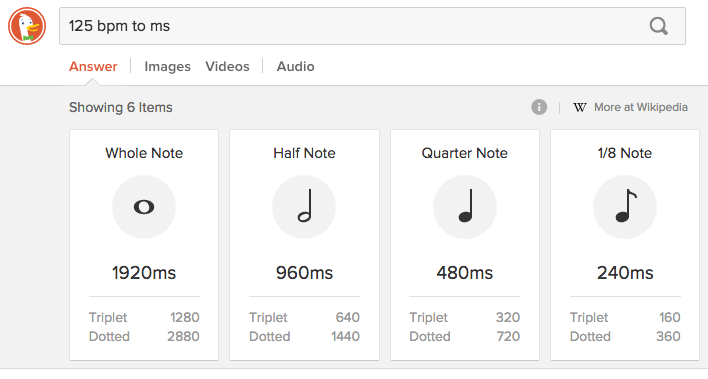
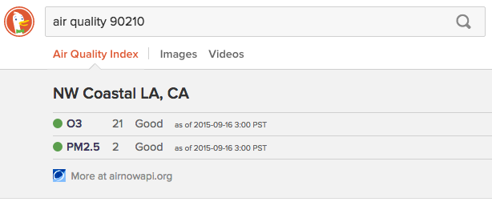
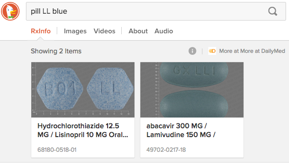
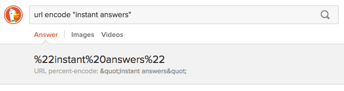
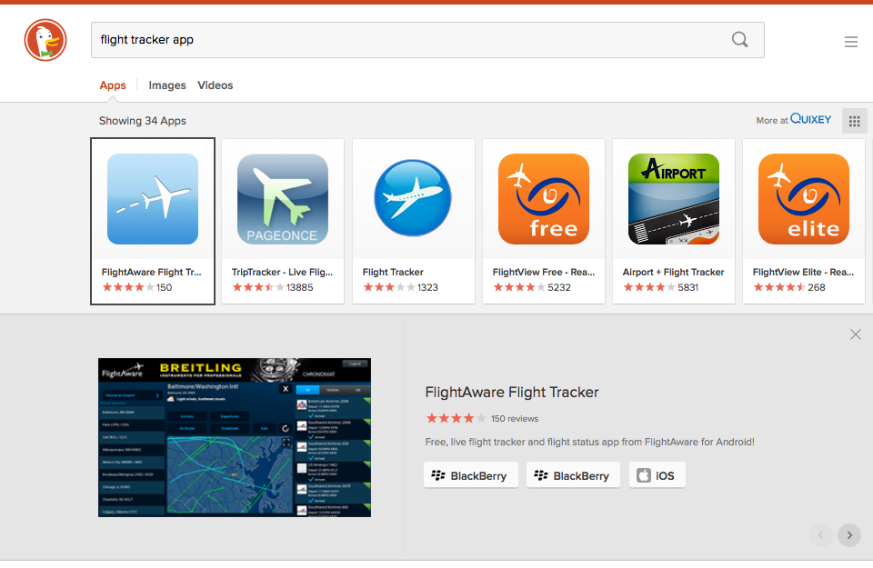

# Welcome to DuckDuckHack

**If you could hack your search engine to put the best information first, what would you do? **

Instant Answers are an opportunity to create your own results. They appear on DuckDuckGo.com above ads and organic links, which serves [millions of searches](https://duckduckgo.com/traffic.html) every day. 

Most importantly, Instant Answers are created by an open source community of developers [around the world](http://duckduckgo.meetup.com/). Welcome!

*[Email us](mailto:open@duckduckgo.com) at any time with questions, or join us [over on Slack](mailto:QuackSlack@duckduckgo.com?subject=AddMe).* 

## Create a New Instant Answer

Learn to make an Instant Answer by starting with any of our quick tutorials. All of these are self-contained and will get you up and running. Pick whatever looks most interesting!

- **[Create a programming syntax cheat sheet](#)**
- **[Create a quick online calculation](#)**
- **[Build an API-based forum lookup](#)**

## Improve an Already Live Instant Answer

We welcome new contributors to dive in and improve live Instant Answers. It's a great, hands-on way to learn how things work. Start by [setting up your development environment](#).

Have a [favorite Instant Answer](http://duck.co/ia) that you want to make even better? Feel free to dive in. 

We also make sure to identify "low-hanging fruit" for new community members to work on. 

- [Goodie Low Hanging Fruit](https://github.com/duckduckgo/zeroclickinfo-goodies/issues?q=is%3Aopen+is%3Aissue+label%3A%22Low-Hanging+Fruit%22) (Instant Answers that **do not** make external calls) 
- [Spice Low Hanging Fruit](https://github.com/duckduckgo/zeroclickinfo-spice/issues?q=is%3Aopen+is%3Aissue+label%3A%22Low-Hanging+Fruit%22) (Instant Answers that call external APIs)

## Inspiration

Instant Answers allow you to create your own search results. Here are some examples of what contributors have created. You can see [all live Instant Answers listed here](https://duck.co/ia).

Instant Answers can be quite dynamic...

...or simply convenient:

Some are just cool: 

Many are absolutely delightful and unexpected:

Many are super practical...

...in ways we never imagined:

Some Instant Answers are built from pure code:

Other Instant Answers channel external sources (API requests):

The [possibilities are endless](https://duck.co/ideas). **Our community's mission is to cover every topic with a community-generated Instant Answer.**

## Discuss with Us

Want help? Need to think out loud? [Join us over on Slack!](mailto:QuackSlack@duckduckgo.com?subject=AddMe). 

We're a digital community, but real people - we frequently meet up to hack together. Check out our [global meetups](#).